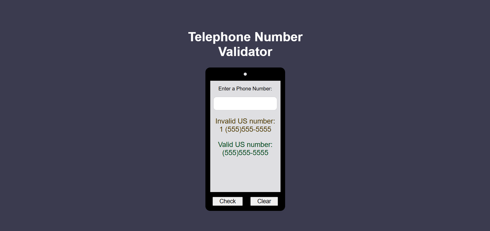

**Telephone Number Validator**  
Check if a given input is a valid US phone number using format-based validation and interactive feedback in the browser. This project handles common US formats like 555-555-5555, (555)555-5555, 1 555 555 5555, and more.

**Link to project:** [Telephone Number Validator](https://ayushsaxena0.github.io/telephone-number-validator/)

Telephone Number Validator Screenshot  
Alt tag: Screenshot of Telephone Number Validator web interface

**How It's Made:**  
**Tech used:** HTML, CSS, JavaScript

This project uses vanilla JavaScript to validate whether a user-entered phone number matches accepted US formats. The logic manually checks characters by mapping digits to placeholders (like "a") and comparing the result against a predefined list of valid format strings. DOM manipulation is used to grab user input and dynamically display feedback messages. There’s also a clear button that resets the result output, improving overall usability.

**Optimizations** *(optional)*  
I plan to replace the current placeholder-matching logic with a more scalable regular expression-based approach. This will simplify the validation, reduce code redundancy, and allow for easier maintenance as more formats are added in the future.

**Lessons Learned:**  
Working on this project helped me explore input validation techniques without relying on regular expressions. I learned how to build format matchers from scratch, map input values dynamically, and give real-time feedback through the DOM. It also reinforced the importance of thinking ahead about scalability — which is why the regex refactor is on my roadmap.
